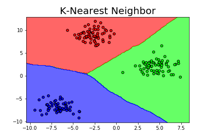
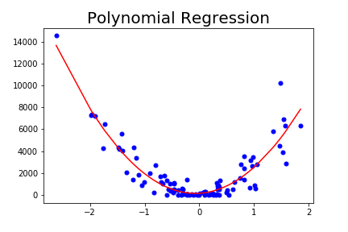
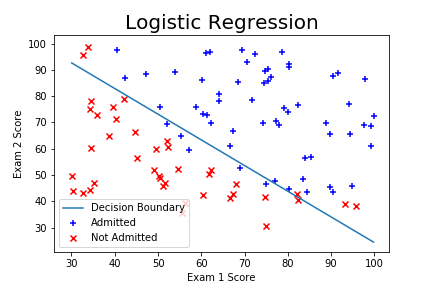
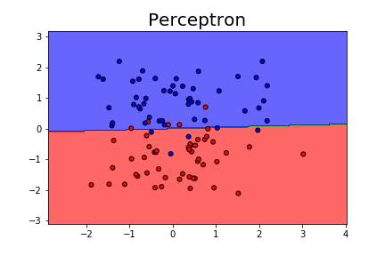
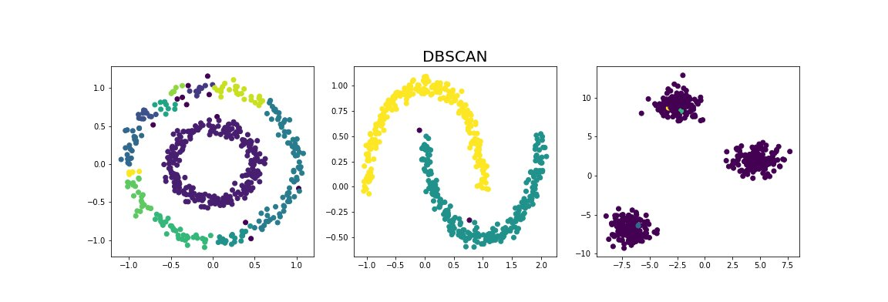
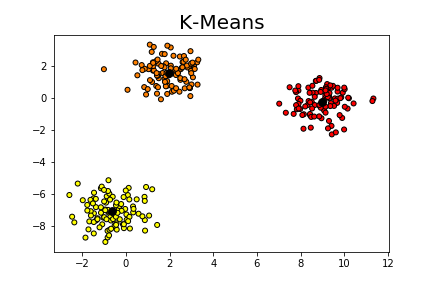
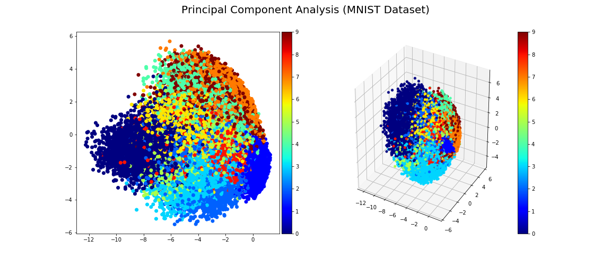

# Machine Learning Algorithms Implemented from Scratch

In this repository, you can find the implementation of Machine Learning Algorithms from scratch. The aim of this project is to understand the fundamentals of the algorithms.

You can find a comparison with the popular ML/DL libraries [Scikit-Learn](https://scikit-learn.org/stable/) and [Keras](https://keras.io/). 

# Examples

---------------------

---------------------

---------------------

---------------------

---------------------

---------------------

# REFERENCES

**Please check out the [REFERENCES](REFERENCES.md) file.**

